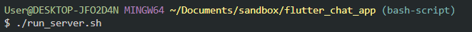
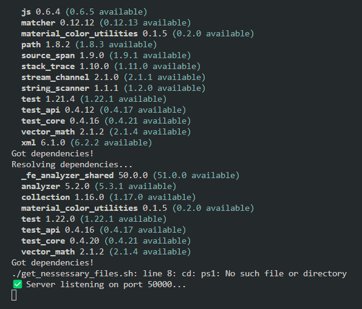
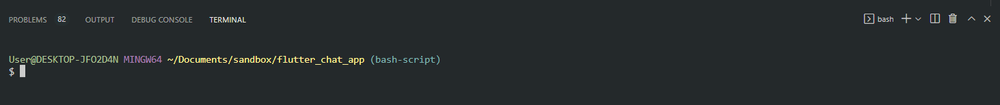
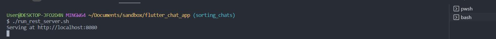
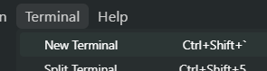
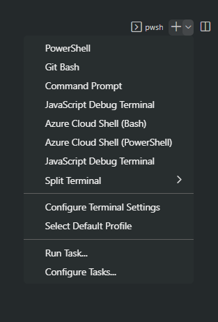

# chat_app

- На данный момент реализовывается основной каркас мессенджера: отправка сообщений одного пользователя другому через сервер с кешированием данных на персональном устройстве.
## Отчет по build 0.1.05:
- Реализованы следующие модули:

### GRPC:
- Унарный метод передачи сообщения клиент-сервер.

### Чат менеджер:
- Отображение страницы профиля.
- Отображение страницы чатов, выбор чатов, сообщения.
- Отображение загрузки сообщения на сервер.

### SendManager:
- Работает отправка сообщения, запись в локальную базу и серверную базу.

### SignalService:
- Реализованы сигналы на основе изменения БД, подключение к интернету.

### StorageManager:
- Реализована инициализация локальной БД. При ее отсутствии создается локальная БД с первоначальными таблицами. Реализованы CRUD-операции. Реализована прослушивание изменение в локальной БД

## How it works:
После клонирования перед запуском прописываем в консоль:
- Вы должны находится в директории приложения
- `dart pub get` или `flutter pub get`
- Переходим в директорию сервера
- `cd \server`
- `dart pub get`

Генеация прото файла для клиента:
- `protoc -I .\proto\ .\proto\chats.proto --dart_out=grpc:./lib/src/generated/chats`
- `protoc -I .\proto\ .\proto\messages.proto --dart_out=grpc:./lib/src/generated/messages`
- `protoc -I .\proto\ .\proto\users.proto --dart_out=grpc:./lib/src/generated/users`

Генерация прото файла для сервера
- `protoc -I .\proto\ .\proto\chats.proto --dart_out=grpc:./server/lib/src/generated`
- `protoc -I .\proto\ .\proto\messages.proto --dart_out=grpc:./server/lib/src/generated`
- `protoc -I .\proto\ .\proto\users.proto --dart_out=grpc:./server/lib/src/generated`

Запуск локального сервера:
- Вы должны находится в директории сервера `cd` \server
- `dart .\server.dart `

В консоли проверьте на каком порту реализован сервер. Зайти в файл `lib/client/grpc_client.dart` Поменять порт на тот который вывел сервер.

Можем запускать приложение:
- Вы должны находится в директории `flutter_chap_app`
- `flutter run` 

При ошибках с grpc или Базой: 
Проверьте что база создана (Создается на каждом пк отдельно, тк файлики `.dart_tool` в `.gitignore`)

Для проверки успешной записи в базу раскомментировать нужные строки(создать базу) в файле:
`\server\lib\src\test_db\test.dart`

Запуск проверки:
`dart .\server\lib\src\test_db\test.dart`

### Запуск приложения 
Каждый шаг выполнять в отдельной консоли, не закрывая предыдущие.

1. Запустить [gRPC сервер](#^066ceb)
2. Запустить [REST сервер](#^f51363)
3. Запустить клиент (`flutter run`)

#### Запуск gRPC сервера

^066ceb

1. [Открыть консоль bash](#^617191)

2. В консоли из директории приложения запустить команду `./run_server.sh`.

Скрипт запустит pub get как для основного приложения, так и для сервера; сгенерирует protoc для grpc; запустит сервер в консоли).

#### Запуск REST сервера

^f51363

1. Открыть консоль bash.
2. Запустить команду `./run_rest_server.sh 

##### Как запустить консоль bash в Windows (Visual Studio Code)

^617191

1. Открыть новый терминал

2. В открытом терминале открыть выпадающий список launch profiles

3. Выбрать bash

 